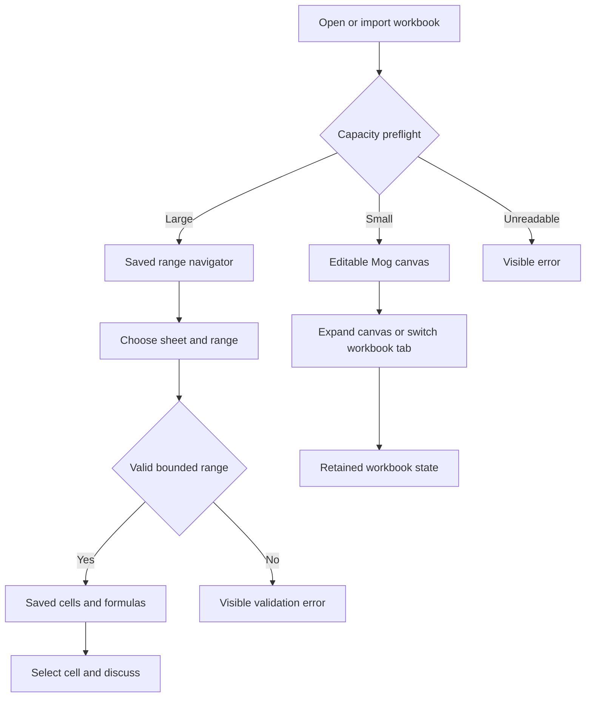
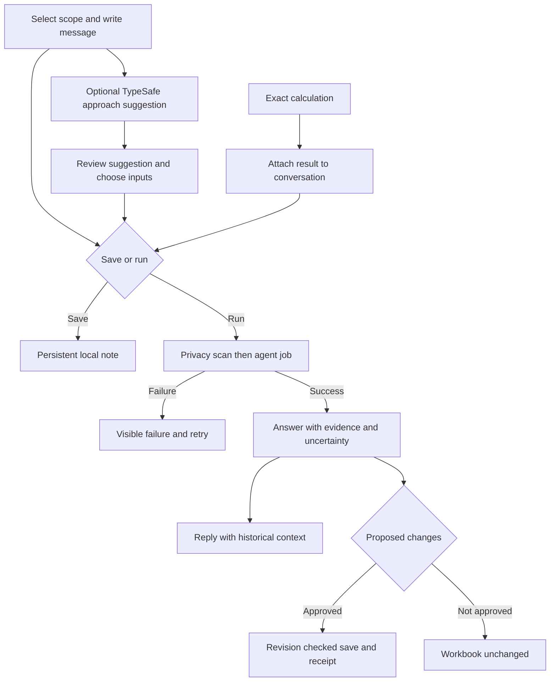

# Dogfood Report — codex/latency-consolidation-baseline

> Diff-scoped QA versus origin/main, including the current large-workbook and collaboration changes. Checkpoint 2026-09-20.

## Diff Summary

- Financial workbench, examples, deterministic evidence tools, parallel workbook tabs and local imports.
- Preflight redirects intensive models to a bounded, read-only saved-cell navigator before engine startup.
- Conversation follow-ups, classification/scoring, evidence attachments and optional TypeSafe tool suggestions.

## Personas

- **Financial consultant (inferred from user request):** inspect real models quickly, challenge evidence and direct an agent without losing work.
- **Reviewer (inferred):** distinguish saved evidence, calculations and judgments; preview changes before applying.
- Pack resolver returned no roots, warnings or errors.

## Flows Tested

## Test Matrix & Results

| # | Flow | Journey / Scenario | Status | Issue | Fix | Commit |
|---|------|--------------------|--------|-------|-----|--------|
| 1 | Large file | Open actual v12 copy; navigate sheets/ranges; no engine loaded | Pass | 78 sheets, 790,047 cells, 429,619 formulas. Production browser traversed all 78 sheets: mean 47 ms, maximum 207 ms, zero WASM loads. Mapped Data A26:L50 and selection A26 also tested. | Removed redundant profile panel; allowed legitimate Excel extension formulas while retaining cell privacy validation. | 8ec03b2 |
| 2 | Files | Other three source copies; import, full canvas, retained tabs | Pass | Cross-check and Profitability: real canvas ready. Labor: saved view. Retained three tabs; full canvas reused ready engine. | | |
| 3 | Conversation | Scope selection, saved note, real agent answer and follow-up | Pass | Real Claude classification then contextual score follow-up completed. Privacy refusal visible for v12. | | |
| 4 | Specialists | Classification, score, TypeSafe suggestion and visible uncertainty | Pass | Claude profitable classification and 2/5 evidence score with caveats; real TypeSafe score suggestion, 90% tool-choice confidence. | | |
| 5 | Evidence | Example calculations, attach evidence, discuss, proposed edits | Pass | Production API replay passed 24 assertions across all ten tools and rejection cases. Browser Inspect and Discuss attachment passed. Staging synthetic F2 proposal reviewed and applied; saved-note editing retains attachment. | | |
| 6 | Boundaries | Invalid range, privacy refusal, empty/new workbook, mobile and errors | Pass with paper cut | Invalid range visibly refused; v12 R38 refusal visible; new blank workbook rendered real canvas; mobile layout checked at 390px. | | |
| 7 | Release | Automated gates and production build replay | Pass | r9 at 5287: 324 tests, typecheck, verify; canvas harness 11 checks; production all-sheet navigation, real Claude classification and TypeSafe 99% tool-choice suggestion. All four original source hashes unchanged. | | |

## Pack Compliance

None.

## What Was Fixed

- Intensive workbooks no longer initialize the browser calculation engine; bounded saved ranges remain navigable.
- Legitimate Excel extension formulas no longer prevent sheet navigation.
- Conversation state stays with its workbook; follow-ups retain historical evidence and uncertainty.
- Calculation evidence can reach the conversation; editing a saved note retains its attachment.
- Save and Verify remain disabled when there is no editable canvas session.
- TypeSafe suggestions are validated and send only the typed message.

## Paper Cuts (by persona)

- Consultant: invalid range text reports the page-size limit rather than an A1-format example. The error is visible and recoverable.
- Consultant: large models are read-only saved-cell tables, not a full formatted Excel editing surface; no recalculation or date formatting is performed. Shared-formula followers are marked when unexpanded.
- Reviewer: agent workbook-level evidence is a declared prefix (first four sheets, A1:T25), not exhaustive model coverage. v12 triggers the mandatory personal-data guard, so agent execution is refused for that workbook.
- Mobile: the Review Desk works at narrow width; use full canvas for spreadsheet work.

## Console Errors

No browser errors reported by agent-browser in the tested sessions. The app harness intentionally exercises strict-CSP failures; its 11 checks passed. No renderer crash occurred in the final 78-sheet production traversal.

## Human Verifications

None requested. Signed-in local agent and paid synthetic tests are authorized.

## Decisions for a Human

None pending. Large models intentionally use saved read-only browsing; full-model editing/recalculation remains in Excel. TabFM is not deployed because published weights restrict production/commercial use.

## Learnings

Capacity must be assessed before importing or hydrating the browser calculation engine.

### Pack candidates

Show cached-value and coverage limits next to evidence, not only in documentation.

## Final Status

Ready for review at http://127.0.0.1:5287/analyst.html. Local production release: 20260920-collaborative-review-r9. This is a loopback deployment, not public hosting. Earlier listeners remain running; use this URL for the corrected release.

Evidence: final test logs, browser screenshots, source hashes and synthetic API receipts are kept in the Windows temporary directory, not committed with client data. The 78-sheet browser traversal tested A1:L25 on every sheet plus a separate populated next-page range; it does not prove every cell or calculation in the model. Full-model editing and recalculation remain in Excel. TabFM was evaluated but not integrated; TypeSafe is integrated as optional approach selection, while classification/scoring answers come from the agent.

