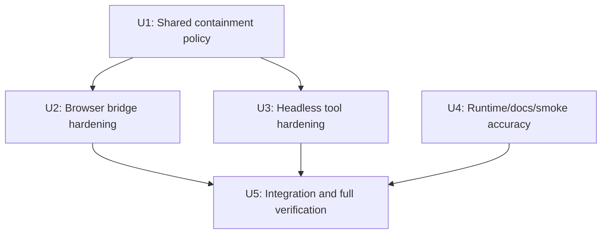

# Mog Canvas Safety Hardening - Plan

## Goal Capsule

- **Objective:** Remove filesystem escape paths and unsafe persistence from the standalone Mog canvas companion, correct its public claims, and make the regression evidence portable.
- **Authority:** The current GitHub `main` snapshot is the integration base. Do not modify Codex configuration, plugin settings, trusted-project settings, or Codex application internals.
- **Execution profile:** Four isolated Claude Code worktrees with one designated integration worktree.
- **Stop conditions:** Stop and surface a decision if containment cannot be implemented consistently on Windows junctions and Unix symlinks, or if the current official Codex plugin/MCP Apps surface changes the product boundary materially.

---

## Product Contract

### Summary

The companion app must constrain both browser-mediated and headless workbook operations to its configured workbook root, preserve the prior workbook through safe replacement, and describe the actual Codex integration boundary precisely.

### Problem Frame

The initial prototype proves a real Mog embed, but its path checks are lexical, its headless tool accepts arbitrary paths, and its save sequence can leave the primary workbook absent after an interrupted write. Its documentation also overstates both its fallback behavior and Codex's absence of custom UI surfaces.

### Requirements

**Filesystem containment**

- R1. Browser bridge operations must reject path traversal and any symlink or junction that resolves outside the canonical workbook root.
- R2. Headless workbook operations must apply the same relative-path, canonical-path, extension, and root-containment policy as browser bridge operations.
- R3. Workbook endpoints must only accept `.xlsx` workbook paths, and screenshot endpoints must only accept approved image output paths.

**Persistence**

- R4. Saving a workbook must preserve a recoverable previous version without leaving the primary path absent after a failed replacement.
- R5. Save failures must return an actionable error and leave either the original workbook or a clearly recoverable backup available.

**Runtime and documentation accuracy**

- R6. The unavailable-adapter fallback must not be bypassed by an unconditional startup import of Mog package assets.
- R7. Documentation must distinguish the unavailable arbitrary-local-side-panel path from the supported Codex plugin/MCP Apps custom-UI surface.
- R8. The documented narrow-window and browser smoke claims must match exercised evidence.

### Scope Boundaries

- The work hardens the standalone companion; it does not build or install a Codex plugin.
- The work may add package-local tests and scripts, but must not widen `MOG_WORKBOOK_DIR` permissions or depend on global settings.
- A first-party Codex MCP Apps/plugin implementation is deferred until the supported API and Mog transport boundary are selected separately.

---

## Planning Contract

### Key Technical Decisions

- KTD1. Canonical filesystem policy: resolve the configured root and every requested target through filesystem canonicalization before authorizing access. Reject paths that do not exist where canonicalization requires existence; use a staged, same-directory temporary file for new outputs so its parent is canonicalized before write.
- KTD2. One policy module: move path classification, extension allowlists, and root checks into a shared server-safe utility consumed by the Vite bridge and Node headless scripts. Do not duplicate slightly different validators.
- KTD3. Crash-resilient save: write validated bytes to a unique temporary file in the target directory, flush/close it, rotate the current workbook to `.bak`, atomically rename the temporary file into place, and restore the backup if promotion fails.
- KTD4. Documentation boundary: state that an arbitrary local Vite view cannot be mounted directly into Codex, while current official plugin/MCP Apps UI mechanisms are a separate supported integration route that this prototype does not yet implement.
- KTD5. Branch isolation: each worktree owns a non-overlapping file cluster. The integration worktree alone resolves conflicts, updates shared documentation, and runs the full suite.

### Work Relationships

### Worktree Allocation

| Worktree | Branch | Owner | Exclusive responsibility | Depends on |
| --- | --- | --- | --- | --- |
| `wt-containment` | `fix/containment-policy` | Claude A | Shared canonical-path and allowlist utility plus its tests | none |
| `wt-bridge` | `fix/bridge-safe-save` | Claude B | Vite file bridge, staged save, backup recovery, bridge tests | U1 interface only |
| `wt-headless` | `fix/headless-containment` | Claude C | Headless script migration to shared policy and tests | U1 interface only |
| `wt-runtime-docs` | `fix/runtime-docs-smoke` | Claude D | Adapter startup behavior, smoke browser selection/viewport coverage, README/API evidence | none |
| integration checkout | `main` or `agent/integrate-safety-hardening` | Integrator | Cherry-pick in dependency order, resolve shared seams, full regression suite | U2, U3, U4 |

Claude A publishes the policy API before B and C begin their implementation commits. B and C may inspect the planned interface early, but they must not modify the policy module. D is fully parallel and owns all documentation files to avoid merge conflicts.

---

## Implementation Units

### U1. Shared canonical containment policy

- **Goal:** Create one tested policy boundary for workbook-root authorization.
- **Requirements:** R1, R2, R3.
- **Dependencies:** none.
- **Files:** `server/path-policy.ts`, `server/path-policy.test.mjs`, `server/file-bridge.ts`, `scripts/headless-edit.mjs`.
- **Approach:** Define canonical-root resolution, existing-target authorization, staged-output authorization, and purpose-specific extension validation. Expose only the narrow functions required by U2 and U3.
- **Execution note:** Characterize Windows junction behavior before changing existing bridge behavior.
- **Test scenarios:**
  - A normal relative `.xlsx` under the workbook root authorizes.
  - An absolute path and `..` traversal reject.
  - A symlink or junction inside the root that targets outside rejects.
  - A link resolving within the root authorizes when the operation allows it.
  - Non-`.xlsx` workbook and non-approved screenshot extensions reject.
- **Verification:** Unit tests demonstrate canonical containment on the host platform and `npm run typecheck` passes.

### U2. Browser bridge safe persistence

- **Goal:** Apply U1 to every bridge endpoint and replace direct overwrite with recoverable staged persistence.
- **Requirements:** R1, R3, R4, R5.
- **Dependencies:** U1.
- **Files:** `server/file-bridge.ts`, `server/file-bridge.test.mjs`, `vite.config.ts`.
- **Approach:** Route all GET/PUT/validate/screenshot requests through U1. Implement same-directory temporary writes, backup rotation, promotion, cleanup, and rollback. Keep response payloads narrow and explicit.
- **Test scenarios:**
  - A valid workbook saves and creates a prior-version backup.
  - A forced promotion failure preserves a readable original or restores it from backup.
  - Each endpoint rejects an outside-root junction path.
  - Workbook and screenshot endpoints reject disallowed extensions.
- **Verification:** Bridge tests pass and a save/read-back validation proves the new workbook is readable after replacement.

### U3. Headless path-policy parity

- **Goal:** Make the sanctioned agent lane obey the same workbook-root policy as the browser lane.
- **Requirements:** R2, R3.
- **Dependencies:** U1.
- **Files:** `scripts/headless-edit.mjs`, `scripts/headless-edit.test.mjs`, `scripts/verify.mjs`.
- **Approach:** Accept only a policy-authorized relative workbook selector. Use policy-approved sibling image output paths and preserve existing headless edit, re-open, summary, and screenshot behavior.
- **Test scenarios:**
  - A valid relative workbook runs the full edit/validate/screenshot flow.
  - Absolute and traversal selectors fail before the SDK opens a file.
  - A selector passing through an outside-root link fails.
  - Invalid extensions fail without creating sibling images.
- **Verification:** The headless flow passes against the sample workbook and negative cases leave no files outside the workbook root.

### U4. Runtime fallback, smoke portability, and documentation accuracy

- **Goal:** Make runtime failure handling and published claims match tested behavior.
- **Requirements:** R6, R7, R8.
- **Dependencies:** none.
- **Files:** `src/main.tsx`, `src/adapters/index.ts`, `src/adapters/unavailable-adapter.ts`, `scripts/browser-smoke.mjs`, `src/styles.css`, `README.md`, `docs/API-EVIDENCE.md`.
- **Approach:** Ensure the adapter failure path can render if the Mog package/runtime is unavailable. Probe browser candidates rather than hardcoding Chrome. Exercise a stated narrow viewport or relax the documented minimum. Rewrite Codex claims around arbitrary local mounting versus supported plugin/MCP Apps custom UI.
- **Test scenarios:**
  - Package/runtime initialization failure renders the unavailable adapter rather than failing the entire app bootstrap.
  - Smoke selection uses an installed supported browser candidate.
  - Smoke succeeds at the documented minimum width, or documentation states only the width actually exercised.
  - Documentation links and claims match the supported integration boundary.
- **Verification:** Type-check and browser smoke pass, and the checked-in evidence reflects the documented viewport.

### U5. Merge, regression validation, and audit closure

- **Goal:** Integrate all completed worktrees into one reviewable branch and verify every audit finding is closed.
- **Requirements:** R1 through R8.
- **Dependencies:** U2, U3, U4.
- **Files:** only conflict-resolution files from U1-U4 plus `README.md` when final verification evidence changes.
- **Approach:** Integrate the policy commit first, then bridge and headless commits, then the runtime/docs commit. Resolve policy-import conflicts once in the integration checkout. Do not reimplement another worktree's owned changes while merging.
- **Test scenarios:**
  - Full positive workflow: open, edit, save, headless re-open, validate, screenshot.
  - Full negative workflow: traversal, absolute path, disallowed extension, and outside-root link fail in both lanes.
  - Failure-injection save test leaves a recoverable workbook state.
- **Verification:** `npm run typecheck`, `npm run verify`, and `npm run smoke` pass from the integrated branch; the final audit finds no unresolved high or medium finding.

---

## Verification Contract

| Scope | Evidence | Completion signal |
| --- | --- | --- |
| U1 | Path-policy tests on Windows links/junctions | No outside-root target authorizes |
| U2 | Bridge tests and save/read-back test | A failed promotion preserves a recoverable workbook |
| U3 | Headless positive and negative tests | Agent lane cannot escape `workbooks/` |
| U4 | Type-check and portable browser smoke | Claims match runtime behavior and exercised viewport |
| U5 | Full suite and focused re-audit | All high/medium audit findings are closed |

---

## Definition of Done

- Every bridge and headless filesystem operation uses the shared containment policy.
- Workbook replacement is staged and recoverable under the injected failure cases.
- The source and documentation no longer make unsupported absolute claims about Codex UI hosting or the adapter fallback.
- A clean integration checkout passes type-check, headless verification, and browser smoke verification.
- Each worktree contributes a focused commit with no unrelated formatting churn.
- The integration branch contains no abandoned experimental code and the final diff is re-audited against the original findings.
