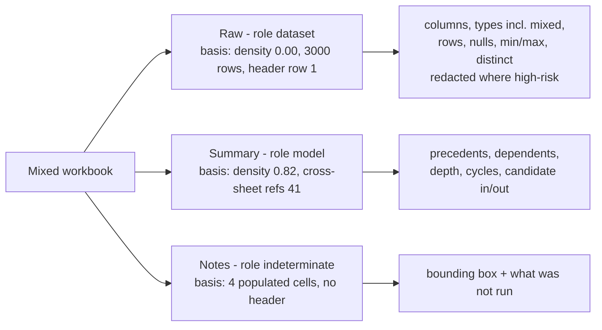
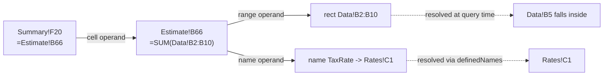
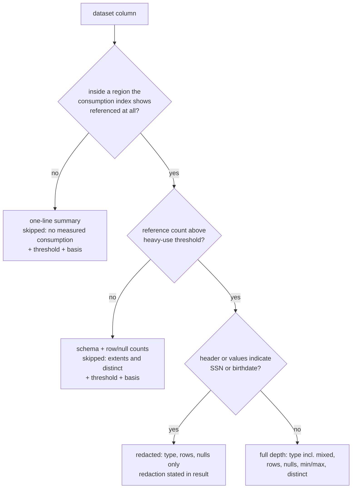

# Hydration Briefing — Progressive Retrieval, Sheet Roles, and Dependency Graph - Plan

## Goal Capsule

- **Objective:** Build the hydration briefing as a **progressive retrieval pipeline** over saved bytes: cheap per-sheet shape and role first, then a cross-sheet consumption index, then depth proportional to how materially a region is actually consumed — a dependency graph where sheets are model-shaped, schema and population statistics where they are dataset-shaped. Engine-free, answering in milliseconds during the ~90 s the renderer spends hydrating.
- **Why this shape:** during that window the briefing **is** the product, not a loading state. It is the only surface with anything in it, and it must stay useful if hydration never completes.
- **Authority:** [`AGENTS.md`](../../AGENTS.md) invariants outrank this plan. [`CONCEPTS.md`](../../CONCEPTS.md) owns vocabulary. [`docs/solutions/design-patterns/validate-workbook-feature-designs-against-a-second-genre.md`](../solutions/design-patterns/validate-workbook-feature-designs-against-a-second-genre.md) governs every feature-value claim here. The organization's payroll-data rule (no birthdates, no social-security numbers in emitted data) binds Stage 3 directly — see KTD11 and R38.
- **Execution profile:** Engine-free throughout. No file in this plan may import `@mog-sdk/*`. Every stage is a pure function over bytes, unit-testable without the engine and without a browser.
- **Stop conditions:** Stop and surface a blocker if (a) the auto-run stages cannot hold the latency budget (R33) on the dataset-shaped fixture, (b) honest coverage reporting would require translating shared formulas, or (c) high-risk-PII redaction (R38) cannot be made reliable enough to emit column statistics at all — in which case Stage 3 ships with statistics suppressed by default rather than shipping a leak.
- **Tail ownership:** Standalone run. The implementer owns branch, validation gate, and commit; the branch `claude/hydration-briefing-dep-graph-24f39b` is already cut from `ec8edf4`.

---

## Product Contract

### Summary

Add a staged, engine-free extraction pipeline on the byte-first lane. Stage 0 reports per-sheet shape and the sheet's *claimed* populated bounding box. Stage 1 hypothesizes a **role per sheet** — dataset, model, mixed, or indeterminate — from evidence, with the basis stated. Stage 2 builds a cross-sheet **consumption index** (cheap) to learn whether and where each dataset-shaped sheet is actually read, and builds a full intra-sheet **dependency graph** only for model-shaped sheets. Stage 3 profiles **schema and population statistics** for dataset regions at a depth proportional to their measured consumption, reporting anything it skipped and why. The briefing auto-runs Stages 0–2 plus materiality-gated Stage 3 inside the latency budget; deeper passes stay agent-invokable on demand.

### Problem Frame

`profile_workbook` and `read_range` (PR #15, `ec8edf4`) proved the asymmetry: the host reads a workbook's own XML in 1–20 ms while the renderer takes ~92 s to become interactive. The profile answers *how big and what shape*. It does not answer what an agent needs to act: which sheets are raw data and which are wiring, what the columns are and what is in them, what feeds a given number, and what the extract could not read.

Two framings had to be corrected before this could be built:

1. **Workbook-level genre is an overfit.** Real workbooks are mixed — dataset sheets feed model sheets in the same file. A single workbook-level label picks one presentation for a file that needs both, and there is no threshold that makes that correct. Role belongs to the sheet.
2. **Dependency edges are the wrong grounding for a data table.** On a 2,469-row raw table the pressing question is not what feeds cell `H1400`; it is what the columns are, what types they hold, how many rows, how many nulls, what range, how many distinct values. Dependency depth there is 1 by construction and tells the agent nothing.

The cost of getting this wrong is documented, not hypothetical: a derivation-chain feature was already demoted once for being measured on a single workbook genre. This plan's answer is not a second global switch but **evidence-proportional depth**: measure cheaply, then spend effort where consumption says it matters.

### Requirements

**Progressive retrieval contract**

- R1. Extraction is staged. Stage 0 (shape and claimed bounding box), Stage 1 (per-sheet role hypothesis), Stage 2 (consumption index, plus dependency graph for model-role sheets), and Stage 3 (schema and population statistics) are separately callable and each returns a self-describing result.
- R2. Each stage result names the stages that produced it and the stages that were **not** run, so a consumer can never mistake un-run depth for absence of findings.
- R3. Every stage is keyed to the workbook revision it was computed from, so two results over two revisions are comparable without re-architecting.
- R4. Later stages consume earlier stages' output rather than re-reading the file; one byte read and one archive decompression serve a whole briefing, with the decompressed part contents passed between stages rather than re-unzipped.
- R5. Any stage may be invoked on demand at greater depth than the briefing chose to auto-run, for a named sheet or range.

**Stage 0 — shape and claimed extent**

- R6. Per sheet, the extract reports the populated bounding box declared by the sheet's `<dimension ref=…>` element, labeled **claimed, not verified** — producers may write a stale or oversized dimension, and this plan never presents it as measured.
- R7. Stage 0 keeps the shipped profile fields (rows, cells, formulas per sheet) intact and additive; no existing field changes meaning.
- R8. When a sheet declares no `<dimension>`, the claimed box is null with a stated reason — never inferred silently and never reported as empty.

**Stage 1 — per-sheet role hypothesis**

- R9. Per sheet, the extract reports a role hypothesis from `dataset`, `model`, `mixed`, or `indeterminate`, derived from the claimed/observed bounding box, formula density (formula cells / populated cells), and header-row detection.
- R10. Stage 1 reports the **observed** bounding box computed from the cell addresses it scanned, and reports agreement or divergence against Stage 0's claimed box. A divergence is a finding, not an error.
- R11. Every role hypothesis carries a basis string naming the evidence and the thresholds used, and is labeled uncalibrated in the same idiom as the shipped `genreBasis`.
- R12. Header-row detection reports what it found — the row index, the header labels, and whether the detection was confident — or reports that it found none, with the reason.

**Stage 2 — consumption index and dependency graph**

- R13. The consumption index reports, for every sheet, the cross-sheet references that **target** it: the referencing sheet, the referencing formula cell, and the referenced address or rectangle.
- R14. The consumption index is built from a single formula-text scan and does not require graph construction; it is the cheap answer to "is this data actually used, and where".
- R15. A full intra-sheet dependency graph is built only for sheets whose Stage 1 role is `model` or `mixed`. Sheets skipped for role reasons are reported as skipped with the role and basis that caused it.
- R16. Formula operands are parsed from saved formula text into a directed graph whose edges point from a formula cell to each thing it reads, resolving four operand classes: single A1 cells, A1 ranges, sheet-qualified references (including quoted sheet names), and defined names.
- R17. Range operands are retained as rectangles rather than expanded to member cells, and a query for a cell resolves against those rectangles.
- R18. The graph answers, for any cell address, its direct precedents and its direct dependents.
- R19. The graph answers a bounded transitive dependents query — reachable dependents with hop distance and an explicit truncation flag — so lineage and blast-radius surfaces can be built on this shape without changing it.
- R20. The graph reports dependency depth (maximum and median chain length over formula cells) and the count of cycles detected, without hanging on a cyclic workbook.
- R21. The graph classifies cells as candidate inputs (referenced by a formula, carrying none) and candidate outputs (carrying a formula, referenced by none), each labeled uncalibrated with its derivation stated.

**Stage 3 — schema and population statistics, materiality-gated**

- R22. For a dataset-role region, the extract reports a column schema: ordinal, header label, and an inferred type.
- R23. Type inference reports **mixed** honestly — when a column's cells disagree on type, the result names the observed types and their counts rather than picking a winner.
- R24. Per column at full depth, the extract reports row count, null/blank count, min and max for ordered types, and distinct count.
- R25. Depth is proportional to measured consumption. Columns inside heavily-referenced regions are profiled at full depth; columns with no measured consumption get a one-line summary. A reference spanning most of a sheet's observed box confers **sheet-level** consumption only — it is not evidence about any individual column, and the result says so rather than treating every column it covers as heavily referenced.
- R26. A column profiled below full depth is **reported as skipped with its reason and the threshold that caused it** — never silently dropped, never presented as if fully profiled. Where the consumption measurement for that sheet is itself incomplete — a non-zero unresolved inbound count, chiefly structured references — the gate must not report "no measured consumption" as a settled verdict: it profiles schema and counts anyway and states the blind spot.
- R27. A dataset-role sheet with no measured consumption stops at bounding box plus headers, and says so.
- R28. Distinct counts and min/max are computed under explicit caps; a cap that bites is reported with the cap named.
- R29. Materiality thresholds are uncalibrated inferences: every threshold that gated depth is reported with its value and a stated basis, in the same idiom as the genre and role labels.

**Hydration briefing**

- R30. One call returns the composed briefing: identity and metadata, per-sheet shape and role with bases, named ranges and tables, the consumption index summary, dependency findings for model-role sheets, schema and statistics for materially-consumed dataset regions, what was skipped, and anomalies.
- R31. Briefing presentation is **per sheet, keyed to that sheet's role** — cell/formula/dependency framing for model-role sheets, column/type/distribution framing for dataset-role sheets, both in the same briefing over a mixed workbook.
- R32. Within a model-role sheet, a derivation-trace section is surfaced only when that sheet's measured dependency depth justifies it; when it declines, it states the measured depth and why a trace would repeat one hop.
- R33. The briefing auto-runs Stages 0–2 plus materiality-gated Stage 3 within the byte-first latency budget — under 400 ms on a dataset-shaped workbook of ~12,000 formulas and ~120,000 cells — and reports its own elapsed time per stage.
- R34. The structured briefing object is the authority and carries stable section identifiers; the prose summary is derived from it. A future UI renders the structure, never re-derives findings from prose.

**Honesty, provenance, and sensitive data**

- R35. Every new result carries the existing as-saved provenance string, unchanged in wording, wherever it travels.
- R36. Failures are typed, never empty: unreadable bytes, missing sheet, and bad target each return a named failure with a reason.
- R37. Every inference — role, header detection, input/output classification, materiality gating — states its basis and is labeled uncalibrated until validated on more than two specimens.
- R38. **High-risk personal data is never emitted.** A column whose header or value shape indicates a social-security/taxpayer number or a birthdate is reported as present and redacted — name, type, row count, and null count only — with min/max, distinct values, and any sample suppressed and the redaction stated. Redaction is reported, never silent omission.
- R39. No stage emits raw cell values as samples in the briefing by default. Values reach a caller only through the existing `read_range` tool, which the caller invokes deliberately.
- R40. Caps that bound work (operand caps, node caps, cell caps, distinct caps) are reported when they bite; silent truncation is a defect.

**Workbook metadata and defined names**

Numbered after the stage groups to keep the identifiers above stable; read as a prerequisite of Stage 2 (name resolution), Stage 3 (header labels from table definitions), and the briefing's identity section.

- R41. The extract reports document metadata from `docProps/core.xml` and `docProps/app.xml` — creator, last modified by, created, modified, and producing application — with absent fields represented as null rather than omitted.
- R42. The extract reports every defined name with its name, raw reference text, and scope (workbook-global, or the sheet name resolved from `localSheetId`).
- R43. The extract reports every table definition — name, display name, sheet, range, and column names — from the `xl/tables/table*.xml` parts.
- R44. Metadata extraction failure on an otherwise readable workbook degrades to nulls and empty lists with a stated reason; it never fails the whole read.
- R45. The briefing is self-contained: every finding in it is derived from saved bytes alone, so it is complete and useful whether or not the renderer ever becomes ready. No section waits on, or degrades because of, engine or renderer state.

### Acceptance Examples

- AE1. **Covers R9, R31.** Given a mixed fixture with a 3,000-row single-sheet table (`Raw`) and a 4-sheet formula cascade (`Summary`, `Estimate`, `Drivers`, `Rates`), when the briefing is composed, then `Raw` carries role `dataset` and a column/type/distribution section while `Summary` carries role `model` and a dependency section — in one briefing, with no workbook-level switch choosing between them.
- AE2. **Covers R6, R10.** Given a sheet whose `<dimension ref="A1:Z5000"/>` overstates a table that actually ends at row 3,000, when Stage 0 and Stage 1 both run, then the claimed box reports `A1:Z5000` labeled claimed-not-verified, the observed box reports the true extent, and the divergence is reported as a finding.
- AE3. **Covers R13, R25, R26.** Given `Raw` whose column `Amount` is referenced by 40 cross-sheet formulas and whose column `Notes` is referenced by none, when the briefing auto-runs, then `Amount` is profiled at full depth and `Notes` appears as skipped with the reason "no measured consumption" and the threshold that decided it.
- AE4. **Covers R15, R27.** Given a dataset-role sheet that no formula anywhere references, when the briefing auto-runs, then no dependency graph is built for it, no column statistics are computed, and the briefing states the sheet stopped at bounding box plus headers because nothing consumes it.
- AE5. **Covers R17, R18.** Given a formula `=SUM(Data!B2:B10)`, when dependents of `Data!B5` are requested, then the formula cell is returned because `B5` falls inside the retained rectangle.
- AE6. **Covers R32.** Given a model-role sheet whose maximum dependency depth is 1 across 12,000 formulas, when the briefing is composed, then no derivation-trace section is surfaced for that sheet and the briefing states depth is 1 so a trace would repeat one hop.
- AE7. **Covers R23.** Given a column holding 2,400 numbers and 6 text values, when its schema is reported, then the type is `mixed` naming both observed types with their counts — not `number` with the text silently ignored.
- AE8. **Covers R38.** Given a payroll-shaped dataset sheet with columns `SSN` and `Date of Birth`, when Stage 3 runs at full depth, then both columns are reported as present and redacted with type, row count, and null count only, no min/max or distinct values are emitted for them, and the redaction and its reason appear in the result.
- AE9. **Covers R20.** Given a workbook where `A1` is `=B1` and `B1` is `=A1`, when the graph is built, then a cycle is reported and depth computation terminates.
- AE10. **Covers R19.** Given a chain `Summary!F20` ← `Estimate!B66` ← `Data!B2:B10`, when transitive dependents of `Data!B5` are requested with a hop bound of 2, then both `Estimate!B66` (hop 1) and `Summary!F20` (hop 2) are returned with their hop distances.

### Scope Boundaries

**In scope:** server-side staged extraction, consumption index, dependency graph, schema/statistics, briefing composition, the MCP tool surface, and unit/integration tests over hand-built OOXML fixtures.

**Deferred to follow-up work**

- Shared-formula translation. Followers of `<f t="shared">` carry no text of their own; deriving their edges requires A1 offset arithmetic on the master. v1 counts them as unresolved instead.
- Structured table reference resolution (`Table1[@Column]`). Table definitions land in R43, which is the prerequisite; resolving operands against them is v2. This interacts with Stage 3: a dataset table consumed only through structured references shows low measured consumption in v1, which R26 requires the gate to treat as a stated blind spot rather than a settled "unused" verdict.
- Intra-sheet region segmentation. A sheet holding a data block *and* a formula block is reported as `mixed` with both presentations; carving it into typed regions with their own boxes is a separate problem this plan deliberately does not attempt (see U3's approach note).
- Date-versus-number discrimination. Excel stores dates as serial numbers and the distinction lives in `styles.xml`, which is outside this work's identity. Numeric extents are reported as raw values with that stated; a date column's min/max reads as a serial number, labeled as such.
- Any dev-app or canvas UI for the briefing. R34 exists so that UI is cheap later; this plan ships no UI, and `npm run check:app` stays untouched.
- Lineage / blast-radius surfaces and the claim-vs-measured-effect review card. R19 and R3 exist so these are buildable on this shape; designing them is not this plan.
- Persisting any stage result to disk. Nothing here writes to `.audit/` or anywhere else, which also keeps the redaction surface (R38) confined to in-flight results.

**Outside this work's identity**

- R1C1 formula parsing and external-workbook links (`[1]Sheet1!A1`). Counted as unresolved, never resolved.
- Formatting and `styles.xml` inspection. Input/output classification comes from graph direction (R21); fill colors are revisited only if real files leave R21 ambiguous.
- Any use of the Mog engine to verify graph or statistics correctness. The file's own cached values are the oracle this repo already trusts.
- Statistical inference beyond population description — no distribution fitting, no outlier scoring, no anomaly models. Counts, extents, and distinct counts describe; they do not conclude.

### Outstanding Questions

- Q1. **Deferred.** Do real dataset workbooks reference their tables mainly through structured references, such that v1's consumption index under-measures consumption? The job-log specimen is built around a 27-column table, so likely yes. R26's skip reporting plus the blind-spot note above makes the gap visible rather than hidden, so it does not block v1 — but it is the highest-value follow-up.
- Q2. **Deferred.** Is 400 ms (R33) the right ceiling now that Stage 3 statistics are inside the auto-run? It is set an order of magnitude above the measured 20 ms profile cost, raised from the pre-revision 250 ms because materiality-gated column statistics are real work. The implementer records the measured figure per stage and tightens the claim to what was measured.
- Q3. **Deferred.** Are the Stage 1 role thresholds and the Stage 3 materiality thresholds anywhere near right? They cannot be calibrated from two specimens. R11, R29, and R37 require every threshold to travel with its value and basis, so a wrong threshold is visible and correctable rather than baked in silently. Calibration needs a real specimen corpus that does not exist yet.

---

## Planning Contract

### Key Technical Decisions

- KTD1. **Stages are modules, and the pipeline is explicit.** `server/workbook-metadata.ts` (metadata, defined names, tables), `server/formula-refs.ts` (operand parsing), `server/sheet-roles.ts` (Stage 0/1), `server/consumption-index.ts` (Stage 2a), `server/workbook-graph.ts` (Stage 2b), `server/sheet-schema.ts` (Stage 3), `server/workbook-briefing.ts` (composition). The existing `server/workbook-profile.ts` stays the hot, cheap path and is extended additively only. Separate modules matter here because the stages have genuinely different costs and the pipeline's whole value is being able to stop early. One structural constraint across all of them (R4): `readZipEntries()` runs **once** and the decompressed part contents are threaded through the stages as arguments. Each stage may scan the sheet XML it needs, but nothing re-inflates the archive — on a 934 KB workbook that is the difference between one decompression and six.
- KTD2. **Depth is bought with evidence, not chosen by a global switch.** The materiality rule is: role decides *what kind* of depth is meaningful, and measured consumption decides *how much* to spend. This replaces the workbook-genre gate — see Superseded Decisions. It is the plan's central structural decision and every stage boundary exists to serve it.
- KTD3. **The consumption index is deliberately cheaper than the graph, and runs first.** One pass over formula text collecting sheet-qualified operands answers "is this data read, and from where" without building nodes, edges, or depth. On a dataset workbook that is the *entire* useful dependency finding, and it costs a fraction of graph construction. Building the graph first and deriving consumption from it would invert the cost curve the pipeline exists to exploit.
- KTD4. **Ranges stay rectangles; queries resolve against them.** Expanding `B2:B10` into member nodes turns a 2,469-row dataset formula column into hundreds of thousands of nodes and destroys the latency budget. A range operand becomes one edge to one rectangle node, and `dependentsOf(cell)` tests the cell against stored rectangles (R17, AE5). Cost moves from build time to query time, bounded by the number of range operands rather than by their area. *(Survives unchanged from the pre-revision plan.)*
- KTD5. **Coverage and skips are first-class result fields, not log lines.** The parser cannot resolve structured references, external links, R1C1, or shared-formula followers; the materiality gate deliberately declines work. Both must be reported in the result (R2, R26, R40) under the repo's unknown-is-never-empty invariant. A pipeline whose whole design is "do less work on purpose" is dishonest unless it says what it did not do. *(Survives, widened from graph coverage to stage-wide skip reporting.)*
- KTD6. **The claimed bounding box is claimed, and the observed one is measured, and they are reported separately.** `<dimension>` is cheap and often right, but producers write stale and oversized values. Labeling it claimed-not-verified and reporting Stage 1's observed extent alongside it (R6, R10, AE2) costs one field and buys a divergence signal. This is the same claim-versus-measured shape the review surface will later need, arrived at here for a much smaller reason.
- KTD7. **The briefing is composed server-side, not by the agent.** One `read()`, staged in code, returned as one structured object plus derived prose. Composing in the agent would mean many byte reads at open time and would leave provenance, uncalibrated labels, redaction, and skip reporting to the agent's discretion on every call. In code they are enforced and testable. *(Survives unchanged.)*
- KTD8. **Three new tools, not two.** `brief_workbook` (the centerpiece: Stages 0–2 plus gated Stage 3), `graph_workbook` (on-demand deep graph, target-cell and bounded-transitive queries), `describe_sheet_data` (on-demand full-depth Stage 3 for a named sheet or range, bypassing the materiality gate). Metadata still rides additively on `profile_workbook`. The pre-revision plan capped this at two tools on tool-count restraint; progressive retrieval makes "deeper on demand" (R5) a requirement, and a requirement with no callable surface is not implemented. Restraint is preserved where it is free — metadata still adds no tool.
- KTD9. **Depth gates the trace section per sheet; formula count never does.** `docs/solutions/design-patterns/validate-workbook-feature-designs-against-a-second-genre.md` records the inverse claim failing on a real specimen: 12,340 formulas, every cascade one hop, output maximally redundant. R32 encodes the corrected rule, now applied at sheet granularity so a mixed workbook does not lose its model sheet's trace because the file also holds a flat table.
- KTD10. **Stated disposition, per the governing second-genre pattern: the anchor is generalized, not demoted.** The pattern requires one of three dispositions in writing. The pre-revision plan chose demotion ("the graph is a model-genre feature"). This revision chooses the third: the anchor generalizes from *dependency graph* to **evidence-proportional grounding**, of which the graph is the model-role branch and schema/statistics the dataset-role branch. The dataset genre is no longer the case where the feature shows nothing — it is the case where a different, equally concrete answer is produced. That is a stronger disposition and it is why the feedback's point 2 changes the design rather than adding to it.
- KTD11. **Redaction is a coded rule in the extractor, not caller discipline.** Stage 3 emits column statistics, and on a payroll workbook a min/max over a birthdate column or distinct values over an SSN column *is* the leak. The organization's rule (payroll data scrubbed of birthdates and social-security numbers) is therefore implemented at the point of emission (R38): a header/value-shape guard suppresses extents, distinct values, and samples for high-risk columns while still reporting the column's presence, type, row count, and null count. Reporting the redaction rather than omitting the column keeps the unknown-is-never-empty invariant intact. R39's no-samples-by-default rule exists so that the redaction guard is a second line of defence rather than the only one.
- KTD12. **Two synthetic fixtures plus one mixed fixture.** Only `workbooks/sample.xlsx` is committed and real specimens cannot be. So: a model-shaped fixture (multi-sheet chains, defined names), a dataset-shaped fixture (one wide table, per-row depth-1 formulas, structured references, a stale `<dimension>`, a mixed-type column, and payroll-shaped column headers for the redaction test), and a **mixed** fixture holding both — because a mixed workbook is the case the pre-revision design got wrong, and a design correction that has no fixture exercising it is not verified. This is weaker than a real specimen and the implementer should say so; it is the strongest test that survives in the repo.

### Superseded Decisions

Recorded rather than deleted, so the correction is legible.

- **Superseded — workbook-level genre gating (former KTD6a).** The pre-revision plan gated the trace section on *workbook* genre and declared the dependency graph a model-genre feature. This is wrong on real workbooks, which are mixed: dataset sheets feed model sheets in the same file, and one workbook-level label picks one presentation for a file that needs both. Replaced by per-sheet role classification (R9–R12) with per-sheet presentation (R31) and per-sheet trace gating (R32).
- **Status of the shipped `genre`/`genreBasis` fields.** They stay on `profileWorkbook()` unchanged — removing a shipped field is not this plan's business, and as a one-line coarse hint the label is harmless. But it is **demoted for gating purposes**: no new code in this plan may branch on workbook-level genre. `CONCEPTS.md` gains a Sheet Role entry and a note recording that demotion.
- **Superseded — two-tool ceiling (former KTD4).** See KTD8.
- **Superseded — 250 ms budget.** Raised to 400 ms (R33) because materiality-gated Stage 3 statistics are inside the auto-run. Still provisional; see Q2.

### High-Level Technical Design

The pipeline. One byte read; each stage consumes the previous stage's output; the briefing decides where to stop.

```mermaid
flowchart TB
  bytes[Saved xlsx bytes<br/>one read via workbook-service] --> zip[readZipEntries + sheetParts<br/>ooxml-cache.ts, existing]
  zip --> s0[Stage 0: shape + claimed dimension box<br/>U3 - labeled claimed-not-verified]
  zip --> meta[metadata, definedNames, tables<br/>U1]
  s0 --> s1[Stage 1: per-sheet role hypothesis<br/>U3 - box + formula density + headers]
  s1 --> s2a[Stage 2a: consumption index<br/>U4 - one formula-text scan]
  s2a --> s2b{role is model or mixed?}
  s2b -->|yes| graph[Stage 2b: dependency graph<br/>U5 - rectangles, depth, cycles, in/out]
  s2b -->|no| skipg[report skipped with role + basis]
  s2a --> s3{measured consumption<br/>above threshold?}
  s3 -->|yes| deep[Stage 3 full depth<br/>U6 - schema + stats + redaction]
  s3 -->|no| shallow[one-line summary<br/>reported as skipped + reason]
  meta --> brief[composeBriefing<br/>U8 - per-sheet, role-keyed]
  graph --> brief
  skipg --> brief
  deep --> brief
  shallow --> brief
```

Per-sheet presentation. One briefing, two framings, chosen by that sheet's role — never by a workbook-level switch.



Node and edge model for model-role sheets. Unchanged from the pre-revision plan.



Materiality gate for Stage 3 depth. The skip branch is a reported outcome, not an omission.



### Assumptions

- A1. The briefing is an MCP-surface capability for the agent, not a dev-app UI feature — but R34 assumes a UI *will* consume it, so the structure is designed to be rendered rather than only read. This keeps `check:app` out of the blast radius while not making the later UI a rewrite.
- A2. Server-side composition (KTD7) is preferred over the agent stitching calls, because code enforces the honesty invariants that a call sequence leaves to discretion.
- A3. Structured table references are counted, not resolved, in v1 — and this under-measures consumption for tables read only that way. Stated as a blind spot in Scope Boundaries rather than absorbed into a "no consumption" verdict.
- A4. Metadata folds into the profile result rather than becoming a fourth tool; the three new tools are the ones R5 makes necessary.
- A5. Adding fields to `WorkbookProfileResult` is acceptable to existing consumers, since `src/api.ts` types the profile response structurally and additive fields do not break it.
- A6. Header-row detection is heuristic and will be wrong sometimes. R12 requires it to report its confidence and its basis, so a wrong header row is visible in the output rather than silently mislabeling every column.
- A7. High-risk-PII detection by header name and value shape will produce both false positives and false negatives. False positives cost a redacted column (acceptable); false negatives are the real risk, which is why R39 suppresses raw samples by default rather than relying on detection alone. The known weak spot is birthdates: with `styles.xml` out of scope there is no value-shape signal for them at all, so detection there is header-only and an oddly-named birthdate column will be profiled as a plain number column. What that leaks is two serial extents and a distinct count, not a roster — the residual risk this plan accepts, stated rather than assumed away.

### Sequencing

U1 (metadata) and U2 (operand parser) are independent and can be built in either order. U3 (Stage 0/1) depends on neither. U4 (consumption index) needs U2. U5 (graph) needs U1, U2, U3, U4. U6 (schema/stats) needs U3 and U4. U7 (service + MCP) needs U5 and U6. U8 (briefing) needs U7.

The pipeline can be shipped incrementally and remains honest at every cut, because R2 requires each result to name the stages that did not run. A briefing that ran Stages 0–1 only is a valid, honest briefing.

**Stated cut line.** This plan is materially larger than its pre-revision form — 8 units against 5, 45 requirements against 18, three new tools against two — because the feedback added a whole extraction branch (Stage 3) and a whole classification layer (Stages 0–1) that the original design did not have. If it needs to be scaled down, the honest cut is **U1–U5 plus U7/U8 without Stage 3**: that ships per-sheet roles, the consumption index, the dependency graph, and a briefing that presents dataset sheets as bounding box plus headers plus measured consumption, with Stage 3 listed in `notRun`. It delivers the per-sheet correction and the lineage substrate; what it does not deliver is the schema/statistics grounding that feedback point 2 asked for, so it is a deferral to name out loud, not a silent trim.

### Sources and Research

- [`server/workbook-profile.ts`](../../server/workbook-profile.ts) — the byte-first profiler this extends; `formulaTexts()` and `CROSS_SHEET_REF` are the closest precedent for operand scanning, `colNumber()` is the address math to mirror, and `genreBasis` is the wording model for every uncalibrated label in this plan.
- [`server/ooxml-cache.ts`](../../server/ooxml-cache.ts) — `readZipEntries`, `sheetParts`, `attr`, `unescapeXml`, `parseSharedStrings`. Every part this plan needs is already unzipped here; `sheetParts()` also gives the sheet order that `localSheetId` indexes into. `parseSharedStrings` is what makes Stage 3 type inference and header labels possible without re-reading the archive.
- [`server/context-bus.ts`](../../server/context-bus.ts) — `parseRange()` already parses optionally-sheet-qualified A1 ranges including quoted names and `$` markers, returning normalized start/end row/col. Reuse it for range operands and for the `<dimension>` box rather than writing a second A1 parser.
- [`server/workbook-service.ts`](../../server/workbook-service.ts) — `byteProvenance()` is the exact wording R35 requires; `read()` is the single containment-checked byte read all new methods must go through.
- [`server/mcp/mog-canvas-server.ts`](../../server/mcp/mog-canvas-server.ts) — `registerTool` + `guarded()` + `ok(payload, summary)` is the tool pattern, including the convention that the summary restates provenance in prose.
- [`server/mcp-byte-tools.test.ts`](../../server/mcp-byte-tools.test.ts) — the engine-free integration pattern: local `writeZipStored()` builds stored-ZIP OOXML by hand, driven through a real MCP `Client` over `InMemoryTransport`. New fixtures extend this builder.
- [`docs/solutions/architecture-patterns/host-side-ooxml-profiling-outruns-engine-readiness.md`](../solutions/architecture-patterns/host-side-ooxml-profiling-outruns-engine-readiness.md) — the measured asymmetry (1 ms / 20 ms profile vs renderer ready at +91,661 ms) and the two specimens' shapes that R33's budget and the fixtures are modeled on.
- [`docs/solutions/design-patterns/validate-workbook-feature-designs-against-a-second-genre.md`](../solutions/design-patterns/validate-workbook-feature-designs-against-a-second-genre.md) — governs KTD9, KTD10, KTD12, R32. The derivation-chain demotion recorded there is this plan's nearest prior art; KTD10 is this plan's answer to it.
- End-user experience brainstorm, machine-local at `%TEMP%\compound-engineering-4096\ce-handoff\Mog-Codex-Live-XLSX-f90a965\end-user-experience-brainstorm.md` — source of the briefing-is-the-product framing (§4.1), the genre-conditional presentation requirement (§4.4), the claim-versus-measured-effect shape reused in KTD6 (§2), the lineage prerequisites in §4.11, and the PII/retention constraints in §4.3/§4.12. Machine-local and not durable; the requirements above are the durable record.
- Continuity source for the original objective: `hydration-briefing-dep-graph.md` in the same machine-local store.

---

## Implementation Units

### U1. Workbook metadata, defined names, and table definitions

- **Goal:** One engine-free function returning document metadata, defined names with scope, and table definitions from parts already unzipped.
- **Requirements:** R41, R42, R43, R44, R36. Consumed downstream by R16 (name resolution), R22 (header labels from table columns), and R30 (briefing identity).
- **Dependencies:** none.
- **Files:** `server/workbook-metadata.ts` (new), `server/workbook-metadata.test.ts` (new).
- **Approach:**
  1. Export `extractWorkbookMetadata(bytes)` returning a typed result with `document`, `definedNames`, `tables`, and a `notes` list for degraded fields.
  2. Read `docProps/core.xml` (`dc:creator`, `cp:lastModifiedBy`, `dcterms:created`, `dcterms:modified`) and `docProps/app.xml` (`Application`, `AppVersion`) with the regex-level extraction idiom already used in `ooxml-cache.ts`; absent parts yield nulls plus a note, never a throw.
  3. Parse `<definedNames>` from `xl/workbook.xml`. Resolve `localSheetId` to a sheet name through the ordered list from `sheetParts(entries)`; a name with no `localSheetId` is workbook-global.
  4. Parse each `xl/tables/table*.xml` for `name`, `displayName`, `ref`, and `<tableColumn name=…>`, and attach the owning sheet via that part's worksheet relationship.
  5. Reuse `attr()` and `unescapeXml()`; add no dependency.
- **Patterns to follow:** the part-scanning loop in `profileWorkbook()` matching `^xl/tables/table[^/]*\.xml$`; `sheetParts()` for relationship resolution.
- **Test scenarios:**
  - A workbook with full `core.xml` and `app.xml` returns creator, last-modified-by, both timestamps, and the producing application verbatim.
  - A workbook missing `docProps/app.xml` returns null application fields, a stated note, and still returns the `core.xml` fields.
  - A workbook with no `docProps` at all returns all-null document metadata plus a note, and does not throw.
  - Two defined names, one global and one carrying `localSheetId="1"`, come back with scope `null` and the second sheet's name respectively.
  - A defined name whose reference is a cross-sheet range (`Data!$B$2:$B$10`) preserves the raw reference text unaltered.
  - A table part with three `<tableColumn>` entries returns the display name, the `ref` range, the owning sheet, and all three column names in order.
  - A workbook with no tables and no defined names returns empty lists, not nulls.
  - Bytes that are not a ZIP surface the typed unreadable failure with the reason (R36).
- **Verification:** `npm run typecheck` clean and the new test file passing under `npm test`.

### U2. Formula reference parser with honest coverage

- **Goal:** Turn one formula's saved text into classified operands, and account for everything it could not classify.
- **Requirements:** R16, R40.
- **Dependencies:** none.
- **Files:** `server/formula-refs.ts` (new), `server/formula-refs.test.ts` (new).
- **Approach:**
  1. Export `parseFormulaRefs(text, options)` returning `{ operands, unresolved }`, where each operand is a discriminated union of `cell`, `range`, and `name`, and each unresolved entry carries a cause from a fixed set: `structured-table-ref`, `external-link`, `r1c1`, `unparseable`. (`shared-follower` and `unknown-name` are added by callers in U5, which is where those conditions are detectable.)
  2. Strip string literals before scanning, so `="A1"` yields no operand.
  3. Drop nothing silently: detect `[` … `]` external-link prefixes and `Name[Column]`/`[@Column]` structured references *before* the A1 scan, record them as unresolved, and remove them from the text so they cannot be misread as A1 operands.
  4. Detect R1C1 shapes (`R[-1]C`, `RC[1]`) and record them unresolved.
  5. Scan the remaining text for sheet-qualified and bare A1 references, feeding each candidate through `parseRange()` from `server/context-bus.ts` so quoted sheet names, absolute markers, and single-cell-vs-range collapse are handled in one place. Normalize addresses by stripping `$`.
  6. Treat a remaining bare identifier that matches no A1 shape and is **not immediately followed by `(`** as a `name` operand; the caller resolves it against defined names. The trailing-paren test is the whole function/name discriminator — do not build or import a function-name dictionary, which would go stale and is not needed for this distinction.
  7. Cap operands per formula and set a `capped` flag when the cap bites (R40).
- **Patterns to follow:** `CROSS_SHEET_REF` and `countMatches()` in `server/workbook-profile.ts`; `parseRange()` in `server/context-bus.ts` as the single A1 authority.
- **Execution note:** Build this unit test-first. It is a pure string-to-structure function with a large input space and it is the correctness foundation for U4 and U5 — a failing case here is cheap to write and expensive to discover through the graph.
- **Test scenarios:**
  - `=A1` yields one cell operand with no sheet qualifier.
  - `=SUM(B2:B10)` yields one range operand whose rectangle spans rows 2–10 in one column.
  - `=Data!B1*2` yields one cell operand qualified to sheet `Data`.
  - `='My Sheet'!$A$1` yields one cell operand on sheet `My Sheet` with `$` stripped.
  - `=SUM(Data!B2:B10)+Rates!C1` yields one range and one cell operand, both sheet-qualified.
  - `=TaxRate*B4` yields one name operand `TaxRate` and one cell operand.
  - `=SUM(Table1[Amount])` yields zero resolved operands and one unresolved entry with cause `structured-table-ref`.
  - `=[1]Sheet1!A1` yields one unresolved entry with cause `external-link` and no A1 operand mis-parsed from the remainder.
  - `=R[-1]C` yields one unresolved entry with cause `r1c1`.
  - `="A1"&B2` yields exactly one operand, `B2`.
  - A formula with more operands than the cap returns capped operands and `capped: true`.
  - Function names (`SUM`, `IF`, `YEAR`) never appear as name operands.

### U3. Stage 0 and Stage 1 — per-sheet extent and role hypothesis

- **Goal:** Report each sheet's claimed and observed extent, detect its header row, and hypothesize its role with the basis stated.
- **Requirements:** R1, R2, R6, R7, R8, R9, R10, R11, R12, R36, R37.
- **Dependencies:** none.
- **Files:** `server/sheet-roles.ts` (new), `server/sheet-roles.test.ts` (new).
- **Approach:**
  1. Export `readSheetExtents(bytes)` (Stage 0) returning, per sheet, the shipped shape counts plus `claimedBox` parsed from `<dimension ref=…>` via `parseRange()`, with `claimedBoxBasis` stating it came from the declared dimension and is not verified (R6). No `<dimension>` yields `claimedBox: null` plus a stated reason (R8).
  2. Export `classifySheetRoles(bytes | stage0)` (Stage 1) doing one cell-level pass per sheet that simultaneously computes the observed box from cell addresses, counts populated and formula cells, and inspects the first populated rows for a header row.
  3. Header detection: a candidate row whose cells are predominantly non-numeric strings while the rows beneath it are predominantly not, using shared strings via `parseSharedStrings`. Report the row index, the labels in column order, and a `confident` boolean with its basis; report `none` with a reason when no row qualifies (R12).
  4. Role rule: formula density (`formulaCells / populatedCells`) plus observed row count plus header presence. Low density with a header row and many rows → `dataset`; high density → `model`; too few populated cells to judge → `indeterminate`; **anything that satisfies neither the dataset nor the model rule cleanly → `mixed`**. Every returned role carries a `basis` string naming the density figure, the row count, the header finding, and every threshold value used (R11).
  5. **`mixed` is a coarse fallback, not a segmentation result.** It means "this sheet does not read cleanly as either, so both presentations are offered and neither is asserted" — reported with low confidence and its basis. Do not attempt to locate the data block and the formula block within the sheet: intra-sheet region segmentation is out of scope, and implying it in the role value would overstate what one density figure can support.
  6. Report `claimedVsObserved` per sheet as `agrees` or a described divergence (R10, AE2).
  7. Name every threshold in one exported constant block with basis strings alongside, in the `GENRE_BASIS` idiom, so Q3's calibration work has a single place to land.
  8. Return the typed unreadable failure for non-ZIP bytes (R36); report which stages ran and the revision key (R2, R3).
- **Patterns to follow:** `profileWorkbook()`'s per-sheet loop and `countMatches()`; `GENRE_RATIO_THRESHOLD` / `GENRE_BASIS` as the model for a threshold that travels with its own honesty label; `readRangeFromBytes()`'s `<c>` matching and `colNumber()` for address math.
- **Test scenarios:**
  - A sheet declaring `<dimension ref="A1:D10"/>` reports that claimed box with a basis naming the dimension element, and the basis says not verified.
  - A sheet with no `<dimension>` reports `claimedBox: null` with a stated reason and does not throw.
  - Covers AE2. A sheet whose declared dimension overstates its real extent reports both boxes and a described divergence.
  - A 3,000-row table with one header row and zero formulas is classified `dataset`, and the basis names density 0, the row count, and the detected header row.
  - A 40-cell sheet where 33 cells carry formulas is classified `model`, with density in the basis.
  - A sheet with a header-led data block and a separate formula-dense block is classified `mixed`, with `confident: false` and a basis stating that neither rule matched cleanly — and the result carries no region boxes, because segmentation is not attempted.
  - A sheet with three populated cells is classified `indeterminate`, not `model`, and the basis says the population was too small to judge.
  - Header detection returns the labels in column order for a string header row over numeric data.
  - Header detection returns `none` with a reason on a sheet whose first row is numeric.
  - Header detection reports `confident: false` with a basis when the candidate row is ambiguous (mixed strings and numbers).
  - Every role result carries a non-empty basis naming at least one threshold value.
  - Non-ZIP bytes return the typed unreadable failure.
  - The result names Stage 0 and Stage 1 as run and lists Stages 2 and 3 as not run (R2).

### U4. Stage 2a — cross-sheet consumption index

- **Goal:** Learn cheaply whether and where each sheet's data is actually read, without building a graph.
- **Requirements:** R1, R2, R3, R4, R13, R14, R36, R40.
- **Dependencies:** U2.
- **Files:** `server/consumption-index.ts` (new), `server/consumption-index.test.ts` (new).
- **Approach:**
  1. Export `buildConsumptionIndex(bytes | { sheets, formulas })` returning, per target sheet, the list of inbound references: referencing sheet, referencing cell address, and the referenced address or rectangle.
  2. One pass over formula cells per sheet, feeding each formula through `parseFormulaRefs()` and keeping only operands qualified to a *different* sheet than the formula's own. Unqualified operands are intra-sheet and belong to U5, not here.
  3. Aggregate per target sheet: total inbound reference count, distinct referencing sheets, and inbound coverage by column (the set of columns any inbound rectangle or cell touches) — the column roll-up is what U6's materiality gate consumes.
  4. Carry the unresolved breakdown through from U2 so an index built over structured-reference-heavy formulas reports how much it could not see (R2), and state the structured-reference blind spot in the result rather than reporting zero consumption as certainty.
  5. Enforce a reference cap, reporting it when it bites (R40). Report `elapsedMs` and the revision key (R3).
- **Patterns to follow:** `formulaTexts()` in `server/workbook-profile.ts` for cheap formula-text collection; `ProfileResult`'s discriminated-union shape for the failure case.
- **Test scenarios:**
  - A formula `=SUM(Raw!C2:C3000)` on `Summary` produces one inbound reference on `Raw` naming `Summary` as referencing sheet and the rectangle as referenced range.
  - An intra-sheet formula `=B2*2` on `Raw` produces no inbound reference (it is not cross-sheet).
  - A sheet nothing references reports zero inbound references and an explicit statement that zero is measured, not assumed.
  - Column roll-up for `=SUM(Raw!C2:C3000)+Raw!E5` reports columns C and E as touched.
  - Forty formulas referencing `Raw!C` and none referencing `Raw!G` yield an inbound count of 40 for C and 0 for G.
  - Structured-reference-only formulas produce zero resolved inbound references *and* a non-zero unresolved count with the structured-reference cause and the blind-spot statement.
  - The index cost on the dataset fixture is recorded and is materially below full graph construction on the same fixture — asserted as a relative comparison in one test, since the absolute figure is fixture-specific.
  - The reference cap reports when it bites.
  - Non-ZIP bytes return the typed unreadable failure.

### U5. Stage 2b — dependency graph for model-role sheets

- **Goal:** Build the directed graph over model-role sheets and answer precedent, dependent, bounded-transitive, depth, and input/output questions from it.
- **Requirements:** R1, R2, R3, R4, R15, R16, R17, R18, R19, R20, R21, R33, R36, R37, R40.
- **Dependencies:** U1, U2, U3, U4.
- **Files:** `server/workbook-graph.ts` (new), `server/workbook-graph.test.ts` (new).
- **Approach:**
  1. Export `buildDependencyGraph(bytes, options)` returning a typed `DependencyGraph` or the typed `unreadable` failure, mirroring `ProfileResult`'s shape so the two read alike.
  2. Build only for sheets whose Stage 1 role is `model` or `mixed`. Every skipped sheet appears in a `skipped` list with its role and the role's basis (R15). An explicit option forces inclusion of a named sheet for on-demand deep calls (R5).
  3. Per included sheet, extract address and formula text with the `<c>`/`<f>` matching already proven in `readRangeFromBytes()`. Count `<f t="shared">` followers carrying no text and record them unresolved with cause `shared-follower` — do not translate them.
  4. Resolve each parsed operand: qualify unqualified references to the formula's own sheet; resolve `name` operands through U1's defined names to a cell or rectangle, recording an unresolved `unknown-name` when no definition matches.
  5. Store `precedents` as a map from `Sheet!Address` to operand list, `dependents` as the reverse index for cell operands, and range operands in a per-sheet rectangle list keyed to their dependent formula cell (KTD4).
  6. `precedentsOf(node)` reads the map. `dependentsOf(node)` unions the reverse index with every rectangle on that sheet containing the node (R17, AE5).
  7. `transitiveDependentsOf(node, maxHops)` walks the same structures breadth-first, returning each reached node with its hop distance, an explicit `truncated` flag when the hop bound or a node cap stops it, and a visited set so cycles terminate (R19, AE10).
  8. Compute depth by iterative DFS with an explicit stack, memoized per node, with a visiting-set cycle guard that records a cycle and terminates the branch (R20, AE9). Report `maxDepth` and `medianDepth` per sheet as well as workbook-wide, because R32 gates per sheet.
  9. Derive candidate inputs (appearing as a precedent, carrying no formula) and candidate outputs (carrying a formula, absent from the reverse index), each with a stated basis in the `genreBasis` idiom (R21, R37).
  10. Enforce node and edge caps, setting a `truncated` flag and naming which cap bit (R40). Report `elapsedMs` and the revision key (R3).
- **Patterns to follow:** the `ProfileResult` / `UnreadableProfile` discriminated union and `elapsedMs` timing in `server/workbook-profile.ts`; the cell-matching regex in `readRangeFromBytes()`; `genreBasis` for uncalibrated-label wording.
- **Test scenarios:**
  - On the model fixture where `Summary!F20` is `=Estimate!B66` and `Estimate!B66` is `=SUM(Data!B2:B10)`, `precedentsOf('Summary!F20')` returns exactly `Estimate!B66` and not the two-hop range.
  - Covers AE5. `dependentsOf('Data!B5')` returns the formula cell whose operand was the enclosing range `Data!B2:B10`.
  - `dependentsOf('Data!B99')` returns nothing when `B99` falls outside every rectangle.
  - Covers AE10. `transitiveDependentsOf('Data!B5', 2)` returns `Estimate!B66` at hop 1 and `Summary!F20` at hop 2.
  - A transitive query bounded at 1 hop returns only hop-1 nodes and sets `truncated: true`.
  - A transitive query on a cyclic fixture terminates and reports each node once.
  - An unqualified operand in a formula on sheet `Estimate` resolves to `Estimate!`-qualified, not to the first sheet.
  - A `name` operand resolves through a defined name to its target cell; an undefined name is recorded unresolved as `unknown-name`.
  - Covers AE9. A two-cell cycle reports one cycle, terminates, and still returns a depth for acyclic nodes.
  - On the mixed fixture, the dataset-role sheet appears in `skipped` with role `dataset` and a non-empty basis, and contributes no nodes.
  - The force-include option builds the graph for a dataset-role sheet when explicitly asked (R5).
  - Structured-reference operands on the dataset fixture appear in the unresolved breakdown and `operandsResolved` excludes them.
  - A shared-formula follower without text is counted under cause `shared-follower` and contributes no edges.
  - Candidate inputs on the model fixture include the hand-entered cells formulas read and exclude every formula cell.
  - Candidate outputs include a formula cell nothing references and exclude an intermediate formula cell another formula reads.
  - Per-sheet `maxDepth` is reported alongside the workbook figure.
  - Every classification result carries a non-empty basis string.
  - A graph built past the node cap returns `truncated: true` naming the cap.
  - Non-ZIP bytes return the typed unreadable failure.

### U6. Stage 3 — column schema and population statistics, materiality-gated and redacted

- **Goal:** Describe a dataset region's columns at a depth proportional to measured consumption, reporting every skip and redacting high-risk personal data.
- **Requirements:** R1, R2, R3, R4, R5, R22, R23, R24, R25, R26, R27, R28, R29, R36, R37, R38, R39, R40.
- **Dependencies:** U3, U4.
- **Files:** `server/sheet-schema.ts` (new), `server/sheet-schema.test.ts` (new).
- **Approach:**
  1. Export `describeSheetData(bytes, sheetName, options)` returning a typed per-column result, plus a `gating` block naming every threshold applied and its basis (R29).
  2. Determine each column's depth from the consumption roll-up in U4 and the thresholds: no inbound references → one-line summary marked skipped with reason and threshold; referenced but below the heavy-use threshold → schema plus row and null counts, with extents and distinct counts marked skipped and why; at or above → full depth (R25, R26, AE3).
  2a. Two gate corrections that the naive rule gets wrong, both required:
      - **Whole-sheet references confer sheet-level consumption only.** An inbound rectangle covering most of the sheet's observed box (e.g. `Raw!A1:Z3000`) is recorded as sheet-level evidence and explicitly *not* as per-column evidence for all 26 columns — otherwise one such reference promotes every column to full depth and the gate stops gating. When a sheet's only consumption evidence is whole-sheet, per-column depth falls back to a stated default tier and the result says the evidence was sheet-level.
      - **Incomplete measurement must fail open, not closed.** When U4 reports a non-zero unresolved inbound count for the sheet, a zero per-column reference count is not evidence of non-use. Profile schema and row/null counts anyway, mark extents and distinct as skipped, and state the blind spot with its cause (R26).
  3. Column headers come from the detected header row (U3) or the table definition (U1) when the region is a declared table; report which source was used.
  4. Type inference per column over the cell `t` attributes and value shapes, resolving shared strings. When more than one type is observed, return `mixed` with each observed type and its count (R23, AE7) — never a majority winner.
  5. Full depth computes row count, null/blank count, min and max for numeric columns, and distinct count under a cap; a cap that bites is reported with the cap named (R24, R28, R40). Dates are stored as serial numbers and cannot be told from plain numbers without `styles.xml`, which is out of scope — so a date column reports numeric extents over raw serials, labeled as raw serial values rather than rendered as dates. Text columns report no min/max.
  6. **Redaction guard, applied before any statistic is attached (R38, KTD11):** a column is high-risk when its header matches social-security/taxpayer-number or birthdate patterns (`ssn`, `social security`, `taxpayer id`, `tin`, `dob`, `birth date`, `date of birth`, `birthdate`), or when its values match an SSN shape. A high-risk column returns name, type, row count, and null count only, with `redacted: true`, the matched reason, and no min, max, distinct values, or samples. The column is always reported — redaction is stated, never omission. Note the asymmetry the design must own: SSNs have a recognizable value shape, **birthdates do not** — they are indistinguishable from any other date serial without `styles.xml`, so birthdate redaction is header-driven only. R39's no-samples-by-default rule is what keeps a mis-headed birthdate column from leaking values anyway, and min/max on an undetected date column exposes two serials rather than a roster. State this limitation in the tool description (U7).
  7. Emit no raw cell values as samples anywhere in the result (R39). Values remain available only through the existing `read_range` tool.
  8. A dataset-role sheet with zero measured consumption returns bounding box plus headers and a stated reason, and computes no statistics at all (R27, AE4).
  9. An `override` option runs full depth regardless of the materiality gate, for on-demand calls (R5) — but the redaction guard is **not** overridable.
  10. Report `elapsedMs`, the revision key, and which stages ran (R2, R3).
- **Patterns to follow:** `readRangeFromBytes()` in `server/workbook-profile.ts` for cell iteration, type handling (`s`/`str`/`b`/`e`/`inlineStr`/numeric), and cap-with-flag reporting; `parseSharedStrings` for string resolution; `GENRE_BASIS` for threshold-basis wording.
- **Test scenarios:**
  - A three-column table with a detected header row returns the three headers in ordinal order and names the header source.
  - A table region declared as a table returns headers from the table definition and says so.
  - A column of 2,400 numbers reports type `number`, the row count, the null count, min, max, and a distinct count.
  - Covers AE7. A column of 2,400 numbers and 6 strings reports type `mixed` naming both types with counts 2,400 and 6.
  - A column of 500 populated and 100 blank cells reports a null count of 100.
  - Covers AE3. Given 40 inbound references to column `Amount` and none to `Notes`, `Amount` is full depth and `Notes` is skipped with reason and threshold named.
  - A column referenced twice, below the heavy-use threshold, returns schema plus counts with extents and distinct marked skipped and the threshold stated.
  - A sheet whose only inbound reference is a whole-sheet rectangle does **not** promote all its columns to full depth; the result states the evidence was sheet-level and names the fallback tier applied.
  - A sheet with zero resolved inbound references but a non-zero unresolved inbound count returns schema and row/null counts with the blind spot stated, rather than reporting no measured consumption as settled.
  - A numeric column that holds date serials reports numeric min/max labeled as raw serial values, and no date rendering.
  - A text column reports no min/max and says why.
  - Covers AE4. A dataset sheet with zero inbound references returns bounding box plus headers, no statistics, and a stated reason.
  - Covers AE8. Columns headed `SSN` and `Date of Birth` return type, row count, and null count with `redacted: true` and a matched reason, and no min, max, or distinct values.
  - A column headed `Employee ID` whose values match an SSN shape is redacted on the value-shape rule even though the header did not match.
  - The `override` option produces full depth on an unconsumed column, and still redacts a high-risk column.
  - No result field anywhere contains a raw cell value from a data column (R39) — asserted structurally over the whole result.
  - The distinct-count cap reports when it bites.
  - Every gating decision carries a threshold value and a basis string.
  - A missing sheet name returns the typed `no-such-sheet` failure naming the sheets that exist.
  - Non-ZIP bytes return the typed unreadable failure.

### U7. Service and MCP surface

- **Goal:** Expose the pipeline through the containment-checked service and the MCP server, with metadata folded onto the existing profile.
- **Requirements:** R3, R5, R30, R35, R36, and the surfacing of U1's metadata.
- **Dependencies:** U5, U6.
- **Files:** `server/workbook-service.ts`, `server/mcp/mog-canvas-server.ts`, `server/mcp-byte-tools.test.ts`, `src/api.ts`.
- **Approach:**
  1. Add `graph(name, options)`, `describeSheet(name, sheet, options)`, and `brief(name)` to the service, each reading bytes through the existing `read()` so containment and revision handling are unchanged, and each returning `{ name, revision, …, fidelity, provenance }` in the shape `profile()` already uses (R3, R35).
  2. Extend `profile()`'s result with U1's metadata under a `metadata` field, additive only. Mirror the added fields in `src/api.ts`'s profile response types; no UI change.
  3. Register `graph_workbook` (workbook name, optional target cell, optional hop bound, optional force-include sheet) and `describe_sheet_data` (workbook name, sheet, optional range, optional depth override) with `registerTool` + `guarded()`.
  4. Each tool description states: engine-free, as-saved provenance, typed failures, and the honesty caveats that apply to it — for `graph_workbook`, that structured references and shared-formula followers are counted not resolved; for `describe_sheet_data`, that high-risk columns are redacted and no raw values are returned.
  5. Return `ok(payload, summary)` where the summary restates the key figures and the provenance string in prose, matching the existing tools' convention.
- **Patterns to follow:** `profile()` and `readRange()` in `server/workbook-service.ts` including `byteProvenance()`; the `profile_workbook` and `read_range` registrations in `server/mcp/mog-canvas-server.ts`; the harness and `writeZipStored()` fixture builder in `server/mcp-byte-tools.test.ts`.
- **Test scenarios:**
  - `graph_workbook` over the model fixture returns a payload whose provenance string matches the profile tool's wording exactly.
  - `graph_workbook` with a target cell returns that cell's precedents and dependents.
  - `graph_workbook` with a hop bound returns transitive dependents with hop distances.
  - `describe_sheet_data` over the dataset fixture returns column schema and statistics, and redacts the payroll-shaped columns.
  - `describe_sheet_data` with the depth override profiles an unconsumed column, and still redacts.
  - Either tool on a non-workbook file returns the typed unreadable result with a reason, not an empty payload.
  - Either tool on a path outside the workbook root is refused by the existing guard, with the same error code as the other byte tools.
  - `describe_sheet_data` on a missing sheet returns `no-such-sheet` naming the sheets that exist.
  - `profile_workbook` now returns the metadata block including defined names, and its previously asserted shape fields are unchanged.
  - Every new tool's summary text carries the provenance string.
- **Verification:** `npm run typecheck`, `npm test`, and `npm run check:mcp` all pass; `npm run check:app` is unaffected because no canvas code changed.

### U8. Hydration briefing composition

- **Goal:** One call returning the per-sheet, role-keyed briefing an agent can read while the renderer hydrates.
- **Requirements:** R2, R4, R30, R31, R32, R33, R34, R35, R37, R40, R45.
- **Dependencies:** U7.
- **Files:** `server/workbook-briefing.ts` (new), `server/workbook-briefing.test.ts` (new), `server/workbook-service.ts`, `server/mcp/mog-canvas-server.ts`.
- **Approach:**
  1. Export `composeBriefing({ profile, metadata, extents, roles, consumption, graph, schemas, provenance })` — a pure function over already-computed stage outputs, testable without bytes.
  2. `brief(name)` in the service does one `read()`, then runs Stage 0, Stage 1, Stage 2a, Stage 2b for model/mixed sheets, and Stage 3 for materially-consumed dataset regions, then composes. It reports `elapsedMs` per stage and in total (R33).
  3. Compose workbook-level sections first — identity and metadata, named ranges and tables, the consumption summary — then **one section per sheet keyed to that sheet's role** (R31): dataset-role sheets get columns, types, counts, extents, distinct counts, redactions, and skips; model-role sheets get depth, cycles, candidate inputs and outputs, and the trace section when it earns a place; `mixed` gets both, in that order; `indeterminate` gets its bounding box and what was not run.
  4. Gate each model-role sheet's trace section on that sheet's measured `maxDepth >= 2` and at least one resolved operand (R32, KTD9). When it declines, state the measured depth and that a trace would repeat one hop — never omit silently.
  5. Every sheet section carries the role and its basis verbatim, and the shipped `genreBasis` appears verbatim wherever the workbook-level genre hint is reported at all. No section is chosen by workbook-level genre.
  6. A `notRun` block lists every stage skipped and why, per sheet, so un-run depth can never read as absence of findings (R2).
  7. Anomalies collect cached error values visible in the profile, detected cycles, the unresolved-cause breakdown, claimed-versus-observed box divergences, redactions applied, and any cap that bit (R40).
  8. Give every section a stable identifier and make the structured object the authority; derive the prose summary from it, with each inference carrying its basis inline (R34, R37).
  9. Register `brief_workbook` following U7's tool conventions.
- **Patterns to follow:** the `ok(payload, summary)` prose-summary convention in `server/mcp/mog-canvas-server.ts`; `genreBasis` as the model for how a labeled guess is worded.
- **Test scenarios:**
  - Covers AE1. A briefing over the mixed fixture emits a column/type section for the dataset-role sheet and a dependency section for the model-role sheet, in one result.
  - Covers AE6. A briefing over a depth-1 model-role sheet with a high formula count surfaces no trace section for it and states the measured depth as the reason.
  - A briefing over a model-role sheet of depth 3 surfaces the trace section with candidate outputs and their precedent chains.
  - A mixed-role sheet receives both a dataset section and a model section.
  - An `indeterminate` sheet receives a bounding-box section and appears in `notRun` for Stages 2b and 3.
  - Covers AE4. An unconsumed dataset sheet appears with bounding box and headers, and `notRun` states why Stage 3 did not run for it.
  - No section selection anywhere reads the workbook-level `genre` field — asserted by construction over the mixed fixture, whose workbook-level genre is wrong for at least one of its sheets.
  - The role basis and `genreBasis` appear verbatim rather than paraphrased.
  - The provenance string appears in the briefing output unchanged.
  - A briefing composed over an unreadable profile reports the unreadable status and omits stage sections, rather than rendering an empty briefing.
  - Anomalies include a detected cycle, a non-zero unresolved count with causes, a claimed-versus-observed divergence, an applied redaction, and any cap that bit.
  - Every section carries a stable identifier, and the prose summary contains no finding absent from the structure (R34).
  - Per-stage `elapsedMs` figures are reported and sum to no more than the total.
  - The briefing over the dataset-shaped fixture completes within the R33 budget; the test records the figure and asserts the budget rather than an exact number.
  - `brief_workbook` over the mixed fixture through the MCP client returns the composed payload and a prose summary carrying provenance.
- **Verification:** `npm run typecheck`, `npm test`, `npm run check:mcp` pass, and the briefing over all three fixtures reads as useful prose rather than a field dump on manual inspection.

---

## Verification Contract

| Gate | Command | Applies to | Signal |
| --- | --- | --- | --- |
| Types | `npm run typecheck` | U1–U8 | Clean, no new suppressions |
| Unit and integration tests | `npm test` | U1–U8 | All existing tests plus the new files pass; no existing assertion weakened |
| Shell-entry isolation | `npm run verify` | regression only | Passes — but note what it covers: it transforms the React shell entry and asserts no `@mog-sdk` code is reachable *from that entry*. It says nothing about the server modules this plan adds. |
| Server engine isolation | `rg -n "@mog-sdk" server/workbook-metadata.ts server/formula-refs.ts server/sheet-roles.ts server/consumption-index.ts server/workbook-graph.ts server/sheet-schema.ts server/workbook-briefing.ts` (plus the new test files) | U1–U8 | No matches. This grep, run over the named files, is the only evidence in this plan for the byte-lane engine-free property — it is a source-level check, not a reachability proof. |
| No workbook-genre gating | `rg -ni "genre" server/sheet-roles.ts server/consumption-index.ts server/workbook-graph.ts server/sheet-schema.ts server/workbook-briefing.ts` | U3–U8 | Every hit is a pass-through of the shipped `genre`/`genreBasis` values for reporting; none appears in a conditional. This grep only locates the hits — the implementer must read each one, and the U8 test over the mixed fixture is the actual behavioral check. |
| MCP surface | `npm run check:mcp` | U7, U8 | All checks pass with the three new tools registered |
| Canvas surface | `npm run check:app` | regression only | Unchanged; this plan touches no canvas code |

`npm run typecheck && npm test && npm run verify` is the fast gate per `AGENTS.md`; U7 and U8 add `check:mcp`. In a fresh worktree `check:mcp` needs `npm run build:mcp-app` first.

Latency claims (R33) are verified by the fixture-based assertions in U4, U5, U6, and U8. The implementer records the measured figure per stage and states it as measured-on-synthetic-fixture, not as a claim about real workbooks — per the evidence discipline in `AGENTS.md`.

The redaction requirement (R38) is verified by U6's payroll-shaped fixture columns and the structural no-raw-values assertion, and by U7's tool-level test. A redaction failure is a release blocker, not a finding.

## Definition of Done

**Global**

- R1–R45 are each satisfied by named code and at least one test, or explicitly deferred in Scope Boundaries.
- No file added or changed by this plan imports `@mog-sdk/*`, evidenced by the source-level grep in the Verification Contract over the named new files. `npm run verify` is **not** the evidence for this: per `AGENTS.md` it transforms the React shell entry and proves engine isolation only from that entry, and none of these server modules are reachable from it.
- No new code branches on the workbook-level `genre` field. Role is per sheet; the shipped genre hint is reported, never gated on.
- Every new result type carries as-saved provenance, typed failures, the revision key, uncalibrated labels on inferences, and a statement of which stages did not run.
- Skip and coverage reporting is present on every stage result: no result can claim completeness or exhaustiveness it does not have.
- No high-risk personal data is emitted: no min, max, distinct value, or sample for a column matched by the redaction guard, and no raw data-column values anywhere in any stage result.
- The second-genre test is run against all three fixtures — model, dataset, and mixed. Anything that shows nothing on one role is documented as role-conditional with the role named in writing, rather than dropped or kept as a headline.
- `CONCEPTS.md` gains entries for the new vocabulary — Sheet Role, Progressive Retrieval, Consumption Index, Hydration Briefing — in the existing entry format, plus a note on the Workbook Genre entry recording its demotion from a gating signal to a coarse hint.
- Dead ends and experimental code from abandoned approaches are removed, not left in the diff.
- Commits are conventional, stage named files only, and never `git add -A`; no client workbook filename appears in any tracked file or commit message.

**Per unit**

| Unit | Done when |
| --- | --- |
| U1 | Metadata, defined names with scope, and table definitions extract from a hand-built fixture and degrade to nulls-with-notes when parts are absent |
| U2 | Every operand class parses, and every unclassifiable shape lands in the unresolved breakdown under a named cause |
| U3 | Claimed and observed boxes are both reported with a divergence finding; every sheet carries a role and a basis naming its thresholds; header detection reports labels, confidence, or a stated none |
| U4 | Inbound references and per-column roll-ups are reported per sheet, zero is reported as measured, and the structured-reference blind spot is stated |
| U5 | Precedent, dependent, and bounded-transitive queries answer correctly including through range rectangles; depth, cycles, inputs, and outputs are reported per sheet with bases; dataset-role sheets appear as skipped with their basis |
| U6 | Depth follows measured consumption, every skip names its reason and threshold, mixed types are reported honestly, and payroll-shaped columns are redacted with the redaction stated |
| U7 | The three tools are registered and passing `check:mcp`; `profile_workbook` carries metadata additively with its prior assertions intact |
| U8 | One briefing over the mixed fixture presents the dataset sheet as columns and the model sheet as dependencies, declines the trace on a depth-1 sheet and says why, lists everything not run, and holds the latency budget |
